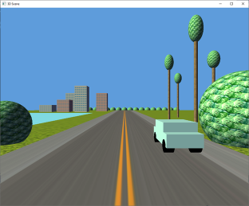

# SNHU Computer Science - Software Development and Software Engineering Portfolio
#### Harrison Bergeron

## Table of Contents

1. [Professional Self-Assessment Introduction](#introduction) | [Full Self-Assessment Document](https://github.com/HarrisonBergeron/CS-499-ePortfolio/blob/gh-pages/Bergeron_ProfessionalSelfAssessment.docx)
2. [SNHU Computer Science Capstone Summary](#snhu-computer-science-capstone-summary)
3. [Code Review Video](https://youtu.be/TB1n0BPRF74) | [Transcript 1](https://github.com/HarrisonBergeron/CS-499-ePortfolio/blob/gh-pages/Bergeron_CodeReviewTranscript_SoftwareEngineeringAndDesign.docx) | [Transcript 2](https://github.com/HarrisonBergeron/CS-499-ePortfolio/blob/gh-pages/Bergeron_CodeReviewTanscript_DataStructuresAndAlgorithms.docx) | [Transcript 3](https://github.com/HarrisonBergeron/CS-499-ePortfolio/blob/gh-pages/Bergeron_CodeReviewTranscript_Databases.docx)
4. [Enhancement One](#enhancement-one-software-design-and-engineering) | [Enhancement One Narrative Document](https://github.com/HarrisonBergeron/CS-499-ePortfolio/blob/gh-pages/Bergeron_Enhancement1Narrative_SoftwareDesignAndEngineering.docx)
5. [Enhancement Two](#enhancement-two-data-structures-and-algorithms) | [Enhancement Two Narrative Document](https://github.com/HarrisonBergeron/CS-499-ePortfolio/blob/gh-pages/Bergeron_Enhancement2Narrative_DataStructuresAndAlgorithms.docx)
6. [Enhancement Three](#enhancement-three-databases) | [Enhancement Three Narrative Document](https://github.com/HarrisonBergeron/CS-499-ePortfolio/blob/gh-pages/Bergeron_Enhancement3Narrative_Databases.docx)

## Introduction

Four years in the computer science program at SNHU has lent me a multitude of learning opportunities through the creation of complex software projects with a focus on maximizing both collaborative and independent problem-solving skills. The culmination of these projects over the years outlines my diverse skillset in computer science and my aptitude for learning how to solve new problems in software. The skills that I have built upon during my time in the program prepare me for navigating the field of software development and software engineering with proficiency. In this portfolio, I introduce three separate software projects I created while studying in the computer science program at SNHU, I review them in a code review screencast, and I enhance each project with new features and functionality to improve upon them and showcase my software development skillset. I outline each project’s purpose, origins, and reasons for including it, and I then list the enhancements I made and how they reached the course outcomes for my computer science capstone at SNHU.

## SNHU Computer Science Capstone Summary

Course Outcomes Reached

One course outcome from the computer science program is CS-499-01: “Employ strategies for building collaborative environments that enable diverse audiences to support organizational decision making in the field of computer science.” I reach this outcome through the creation of a code review about my original code artifacts as well as through the artifacts themselves. Reaching this outcome helps align my career goals with topics I have studied in computer science because code collaboration is an integral part of software development and software engineering. I demonstrate the ability to use interaction to create code review experiences by visually displaying the execution of code artifacts and explaining the functionality of code verbally while highlighting the respective lines of code in the code review. I demonstrate the ability to understand code reviews individually and within a team environment by using a code review checklist to cover important software code review topics and thoughtfully explaining the reasons behind potential code changes in a manner that targets a diverse and uninformed audience. I demonstrate the ability to provide contextual in-code comments that result in easily readable and understandable code by ensuring that complicated classes, functions, statements, and conditions are described with an accompanying inline comment throughout the code artifacts. I also demonstrate the ability to support decision making for software design stakeholders in the original code for artifact one because I developed the artifact using the agile methodology in progressive iterations that addressed new requirements from users and stakeholders with each sprint. In the code review, I use a code review checklist to convey the importance of comments and readable code that improve consistency and clarity in collaborative workspaces, which demonstrates my ability to discuss experiences and best practices working in collaborative environments.

Another course outcome from the computer science program is CS-499-02: “Design, develop, and deliver professional-quality oral, written, and visual communications that are coherent, technically sound, and appropriately adapted to specific audiences and contexts.” I similarly reach this outcome through the creation of a code review. Creating the code review helped prepare me for my career goals in software development and software engineering. I demonstrate the ability to communicate a code review effectively through collaborative environments by recording clear explanations of code using a screencasting program and orally communicating to the audience about code meaning and functionality. I demonstrate the ability to communicate appropriately to specific audiences and contexts by explaining functionality of original code artifacts to an audience that is not yet familiar with their original purpose and describing lines of code with both technical and non-technical vocabulary. I demonstrate the ability to clearly convey my ideas and thought process by orally explaining the original and future intent of artifacts, explaining code functionality in writing through comments, and explaining code functionality visually using a screencasting program to show an audience how a particular codebase behaves. I demonstrate that my code review is technically sound and straightforward by ensuring that my voice is clear and audible throughout the screencast and that unnecessary video segments are edited out to communicate code more effectively.

The other three course outcomes for the SNHU computer science capstone are CS-499-03, CS-499-04, and CS-499-05. These are “Design and evaluate computing solutions that solve a given problem using algorithmic principles and computer science practices and standards appropriate to its solution, while managing the trade-offs involved in design choices,” “Demonstrate an ability to use well-founded and innovative techniques, skills, and tools in computing practices for the purpose of implementing computer solutions that deliver value and accomplish industry-specific goals,” and “Develop a security mindset that anticipates adversarial exploits in software architecture and designs to expose potential vulnerabilities, mitigate design flaws, and ensure privacy and enhanced security of data and resources,” respectively. The first artifact and enhancement target the CS-499-04 and CS-499-05 course outcomes because they demonstrate porting a Java application to C++ with a common industry goal of converting a codebase from one language to another for efficiency purposes, while also ensuring that security flaws are mitigated. The second artifact and enhancement target the CS-499-03 outcome because they implement various new data structures and algorithms while making tradeoffs to maximize time and space efficiency of a program, which is an important skill in the field of computer science. The third artifact and enhancement target the CS-499-04 and CS-499-05 enhancements because they use well-founded tools and techniques to create a database system that solves a common industry problem of managing data storage on a website backend in a secure and private manner. These artifacts were selected to showcase my strengths in software engineering and design, data structures and algorithms, and databases, but they also highlight my strengths in the creation of secure software.

The first enhancement in this portfolio is the conversion of a Java Swing GUI application into a C++ and Qt framework application. This process of transpiling code and utilizing a different API to create the same application is a complicated and research-intensive creative process in software engineering, and it showcases my strengths and abilities in the computer science field through the creation of software that still meets user requirements after transpilation (CS-499-04 & CS-499-05). The second enhancement in this portfolio is the creation of three new algorithms that utilize data structures efficiently to solve problems that frequently show up in the field of computer science. This enhancement connects back to the first enhancement because properly implementing data structures and algorithms is among the more technical aspects of software engineering, and my mastery of these categories further showcases my abilities in software engineering as a whole (CS-499-03). The third enhancement in this portfolio is the creation of a backend server and database script for a frontend static website. Databases and data transfer, especially with security best practices in mind, are ubiquitous issues in software engineering, so including this enhancement puts a finishing touch on my well-rounded experience and knowledge in solving problems in computer science with software engineering and software development in mind (CS-499-04 & CS-499-05).

## Enhancement One: Software Design and Engineering

For the software design and engineering component of the project, I included an artifact from CS 250 that is an interactive slide show application written using Java and its built-in Swing GUI library. The application features “next” and “previous” buttons for a user to cycle through a total of five slides about popular destinations for wellness getaways with text captions describing each location. This project was created to practice GUI design with a strong focus on iterative development techniques using the software development life cycle. I selected this artifact to showcase my skill of iterative development using the Agile methodology to incrementally develop code and create deliverables through weeklong sprints. This artifact is the culmination of multiple software development iterations to improve code and add features to the interactive slide show interface. It also demonstrates my ability to solve problems and create software by algorithmically and programmatically building a GUI (CS-499-04). Creating this GUI through code shows that I can design interfaces without the help of visual cues provided by GUI creation tools that hold the developer’s hand but are somewhat inflexible. I enhanced this artifact by addressing a common software industry goal: porting an application to another programming language with a focus on efficiency. I recreated this slideshow application using C++ instead of Java, and the Qt API instead of Swing. The new C++ and Qt GUI mimics the original implementation, but besides simply being a ported version of the program, it improves on design, security, and documentation.

###### Left: Original Java Swing Application — Right: Ported C++ Qt Application

###### Example converting Java Swing code to C++ Qt code

Enhancement Details

List of Enhancements Performed:
- Convert original Java source code into C++
- Replace Java Swing components and Swing patterns with Qt components and patterns
- Fix formatting and whitespace inconsistencies
- Remove repetitive code for formatting title and description strings
- More dynamic UI sizing
- Create function that automatically adds new slides
- Improve comments and documentation
- Improve variable naming
- Improve conditional branches by considering edge cases
- Check for file existence to prevent errors reading from the disk
- Validate/ignore program input for security purposes

The course objective I intended to meet through creating the enhancement to this artifact is CS-499-04, which stresses software design and engineering techniques. I used innovative skills and techniques for implementing design solutions and accomplishing goals by manually translating code structure and syntax to convert a codebase to a different language and API and improve efficiency. I demonstrated the ability to program solutions to solve logic problems in software by redesigning and refactoring existing code to more concisely create and add new slides to the slide show. The original application replicated code blocks unnecessarily and used loops improperly, and the new implementation grouped repetitive code into reusable functions and removed loops that were not needed in creating slides. I showed that I can address design flaws related to security by validating command line arguments that are supplied to Qt, which prevents users from entering potentially malicious input that could affect how the program executes, and this targets the CS-499-05 course outcome that seeks to mitigate security flaws. I also articulated my ideas in software development by translating lines from the original codebase to the new one to ensure that my new implementation exactly mirrored the original application as I envisioned.

In enhancing this artifact, I gained entirely new experience with the Qt API. While I have plenty of C++ experience, I had never used Qt to develop a GUI. I learned that while some aspects of porting software to other languages and APIs are highly straightforward, there are other aspects that are more complicated and require more creative solutions. For example, mimicking the CardLayout class in Java’s Swing API was as simple as using the Qt analog QStackedLayout. Aside from the class name and syntax for declaring the layout variable, the translation was direct and easy to implement. On the other hand, adding actions to buttons using Qt was more in depth and not as straightforward. In Java and Swing, actions were added by instantiating anonymous listener classes with custom actionPerformed() methods. In C++ and Qt though, actions were added by creating “slots” in header files that would respond to “signals” emitted by Qt widgets, and signals had to be connected to slots using a separate middleman function. At times, research and creativity were required to translate Java code to its C++ equivalent. Another challenge I faced when enhancing this artifact was deploying the completed executable. I had previously deployed the Java implementation simply by packing the compiled Java bytecode into a .jar file that could be executed by double clicking the icon. The same process was not as easy to accomplish in C++. I had to ensure that shared libraries that were not included with the output executable were copied into the final product so that the software would function properly. In doing this, I needed to conduct more research about how to use the “windeployqt” executable through the command line to collect the required binaries and dependencies for deploying the final executable.

## Enhancement Two: Data Structures and Algorithms

The artifact I chose for the data structures and algorithms category is a 3D OpenGL scene viewer where a 3D environment is programmatically constructed to resemble an illustration called Southern Freeway by Hiroshi Nagai (2017). This artifact came from CS 330 and I initially created it to demonstrate my understanding of OpenGL concepts like vertex arrays, transformations, textures, lighting, and shader programs. I selected this item for my ePortfolio because it contains a special Object class representing a tree data structure. This class makes it possible to construct hierarchical 3D scene graphs using trees, where child nodes inherit the translation, rotation, and scaling of parent nodes. There were multiple opportunities to implement new algorithms and utilize new data structures to enhance this artifact by modifying the Object class. 

###### Original Artwork by Hiroshi Nagai (2017)

###### 3D OpenGL Scene Recreation Using C++ and GLFW

###### Generation of Binary Tree Data Structures Using Recursion

Enhancement Details

List of Enhancements Performed:
- Create a function to deep copy tree nodes using a stack data structure instead of recursion
- Implement a radix sort algorithm to sort children of tree nodes by their draw index to allow for more control over the order of 3D rendering of objects
- Create a function to convert tree data structure into a one-dimensional list data structure
- Read shader files from the disk instead of hardcoding them in the source
- Use more portable header guards for source files
- Rename variables and functions to align with Google C++ guidelines
- Improve formatting for indentation and line length
- Remove constants and literals and replace with variables
- Improve documentation and comments for classes
- Improve variable naming
- Use proper variable casting according to C++ guidelines, like static_cast
- Protect against divide by zero errors
- Optimize variable placement in loops
- Cover all conditional cases in if-else branches
- Fix incorrect program termination to avoid leaking resources

I enhanced the code for this application in three different ways. Firstly, I created a function for deep copying tree nodes by traversing all the descendants in a tree. I made the unique choice to implement this tree traversal using a stack data structure instead of recursion to showcase my ability to emulate recursive behavior without self-invoking functions. Instead of invoking a function recursively, a special object is pushed onto a stack data structure to keep track of the current tree depth and iterations. My implementation is analogous to the concept of function stack frames in regular recursion. This enhancement targets the CS-499-03 outcome because I needed to find a creative workaround for a common tree traversal algorithm without using a feature that is language dependent. I showed that I was able to solve a logic problem involving algorithms and data structures by substituting recursion with a stack data structure. I made appropriate tradeoffs when selecting a data structure and algorithm to achieve a similar time and space complexity as recursion. In C++, the call stack has memory limitations that could limit the depth of tree traversal; my implementation uses a stack data structure located on the heap which broadens the amount of space available for deep traversals. Deep copying complex objects is a common goal in software development, and I demonstrated my ability to achieve this goal in two ways. In the code as well as in figure 2, I showcase my enhancement by deep copying the root scene node and displaying it next to the original.

Secondly, I enhanced the artifact by implementing a radix sort algorithm. In OpenGL applications, it is a common goal to manually set the drawing order of objects in order to guarantee that blending works correctly. For example, transparent objects are often rendered after every other object to prevent graphical bugs involving the depth buffer. My algorithm implementation guarantees that the children of every Object node will be sorted by their “draw index” before being drawn. This enhancement targets the CS-499-03 outcome because I used innovative techniques to accomplish an OpenGL industry standard of controlling rendering order of 3D objects. I also evaluated sorting algorithms to determine that comparison-based sorting algorithms usually have a lower limit of O(n log n) time complexity, and the non-comparison-based radix sort achieves O(n) time complexity when the number of digits are constant. Since Objects in this artifact have an integer index, they were the perfect candidate for a radix sort which is highly efficient when many objects will need to be sorted. I made design tradeoffs regarding space efficiency because this algorithm requires allocating an extra array for temporary storage in order to maximize time efficiency. In the code as well as in figure 3, I showcase my enhancement by creating a list (std::vector) of Objects with varying draw indices, and sorting them using my radix sort implementation. The radix sort function is also automatically called in the Object::Draw() function.

My last enhancement adds functionality for converting an Object tree data structure into a one-dimensional list data structure. The Object::Collapse() function can be invoked on a scene graph node which causes all the descendants in the tree to be traversed and added to a list. Ultimately, all hierarchical information is lost when the nodes are gathered into a list, but 3D transformations are combined recursively to preserve the position and orientation of the nodes in 3D space, even though nodes no longer inherit parent transformations. To demonstrate this function, I programmatically create a literal 3D binary tree with branches and leaves using recursive lambda functions. The position and rotation of each branch is inherited from its parent, which allows for easy generation of a tree model using only simple transformations. I then use the Object::Collapse() function to convert this complex hierarchy into a single parent node with a long list of all descendant nodes, showing that the tree has indeed been converted to a one-dimensional list (but remains graphically identical to the original model). This enhancement targets the CS-499-03 enhancement because I implemented an algorithm to convert one common data structure into another, which is a common industry goal. When data needs to be stored or transmitted, it is often useful to be able to convert multidimensional data structures into one-dimensional data structures that can be sent over a stream. There are multiple ways to convert a tree data structure to another data structure, and I clearly articulate my approach using recursion and lists (std::vector) to solve the complex logic problem of traversing and converting this data structure to another form, which targets the CS-499-03 outcome because it achieves the goal of making necessary tradeoffs in algorithm and data structure design to optimize a program. It is clear from the working product in the code and from figure 4 that I can clearly articulate my ideas regarding algorithm design and data structure utilization.

I met all the course objectives I planned to meet in my initial ePortfolio plan for the data structures and algorithms category. When creating the first enhancement featuring a deep copy function, I encountered the challenge of how to organize data within the stack data structure to mimic recursion. It took me a considerable amount of time to decide on the minimal amount of data required for each stack element in order to implement a deep copy. In the end, I discovered that the original node, the copy node, and an iterator marking the current location in the loop through node children were all that was necessary. I learned that using a stack in place of recursion is almost visually identical to recursion despite being more difficult to articulate in code. A technical challenge I faced when implementing the second and third enhancement was using C++ lambdas recursively. I dealt with compiler errors that prevented lambdas from capturing themselves for self-invocation. I learned that declaring the lambda in advance before initializing it allows the function to reference itself for the purpose of recursion. Lastly, in the third enhancement I had difficulty remembering how matrix transformations compose. In order to implement the C++ code to combine parent and child transformations, I had to read up on GLM documentation to learn about how to multiply matrices to combine their linear transformations.

## Enhancement Three: Databases

For the databases category, I enhanced an artifact from IT 270 that was initially a website consisting of non-functional static webpages representing a fake real estate company. The home page featured a “Chat With an Agent” box at the bottom of the screen that allowed the user to enter text into an input field to mimic the concept of live customer service chats. I created this artifact to gain experience in web development by independently building and styling a website frontend over the course of a few weeks. I selected this artifact to enhance because while creating it, I took advantage of multiple learning opportunities to further my knowledge about HTML, CSS, and JavaScript, and this artifact showcases my skills in these subjects as well as provides a starting point for enhancements (CS-499-04 & CS-499-05). The “Chat With an Agent” feature included live JavaScript code but was client-side only and did not actually communicate with a remote server. To enhance this part of the artifact, I created a Node.js server and a MySQL server to accept chat message traffic from the original script and store those chat messages within a database. For company records, it may be desirable to store customer service chat logs so that they may be referenced in the future if necessary.

###### Original Static Website I Created

###### Client-Side Chat Messages

###### Chat Messages Stored on Remote SQL Server

Enhancement Details

List of Enhancements Performed:
- Create a Node.js server as a backend of the original frontend site
- Modify script for client-side chat that sends an XMLHttpRequest to the Node.js server containing chat messages entered by a user
- Add functionality to Node.js server script that accepts traffic from clients and parses chat data sent over the network as JSON
- Create a MySQL database adjacent to Node.js server on same machine
- Add functionality to Node.js server script that stores chat messages sent by client in MySQL database
- Use asynchronous requests to handle database access
- Create private key and certificate using OpenSSL to enable a secure HTTPS connection between the client and server
- Utilize prepared statements in Node.js server script to minimize security risks and prevent SQL injections
- Improve client-side HTML object instantiation using special DOM functions instead of text strings
- Check array size on client-side before accessing to prevent index out of bounds errors
- Add documentation and comments to describe functionality of original client-side script
- Limit the number of chat messages on the client-side to improve memory efficiency

The original script only instantiated UI elements from chat message text and displayed them visually for the client with no real client-server interactions, as the feature was only conceptual. In enhancing this artifact, I created a new script to implement a localhost server with Node.js as the vehicle. In addition, I created a MySQL database server on the same machine. I updated the original script to send HTTP requests to the Node.js server, which then performed SQL queries on the MySQL server to store incoming chat messages from the client within a database. The Node.js server acted as a middleman between the client and the MySQL server. By setting up this MySQL server and managing the database programmatically in the website backend, I target the CS-499-04 course outcome by providing a database solution that delivers value and accomplishes a common industry goal of storing website traffic within a database. I utilized asynchronous methods to make HTTP requests on the client, process them on the server, and make SQL queries on the server, in order to avoid blocking the main thread unnecessarily. I also nested asynchronous callbacks to prevent SQL queries from beginning before a previous query completed. This demonstrates my ability to solve problems involving storing, manipulating, and accessing data effectively and targets the CS-499-04 outcome because asynchronous queries prevented database errors and inconsistencies from arising. Additionally, I used HTTPS and SSL within the Node.js server by using OpenSSL to generate a private key and certificate to allow for encrypted connections between the client and server. I included a hardcoded username and password in the Node.js script to establish a secure connection to the MySQL server. I also used prepared statements in server SQL queries to prevent injection-based attacks on the database. These parts of the enhancement target the CS-499-05 outcome and demonstrate my ability to address design, logical, and structural flaws related to database security by protecting client-server traffic as well as preventing malicious users from attempting to access the database through security loopholes. My enhancement also targets the CS-499-05 outcome because I use innovative skills and techniques to check for database and table existence before modification and create the necessary databases and tables if they don’t already exist, which addresses a design flaw that could impact the security of the database. Similarly, I mitigated design flaws in the client-side script that had the potential to cause index out of bounds errors and overconsumption of browser memory.

When enhancing this artifact, I learned a great deal about Node.js, SQL, and HTTPS in a single week. I learned how to create SSL certificates, create and send HTTP requests, setup a server that hosts files and processes client requests, connect to a MySQL database remotely, and create a variety of SQL queries to search, insert, and delete database records. I learned how to create prepared statements for SQL to prevent injection attacks for security purposes, which is a ubiquitous goal in database design. It took a considerable amount of time to familiarize myself with asynchronous programming in Node.js but doing so paid dividends in facilitating the creation of the server script and processing client requests and queries. A surprising challenge I faced was using the command line interface to not only generate a private key and certificate request, but to sign the certificate manually and apply the necessary extensions to make the certificate valid in Google Chrome browsers. I learned that OpenSSL documentation was widely considered to be lacking and in need of redesign. I spent the most time with OpenSSL documentation, followed by Node.js and SQL documentation, although I still needed refreshers on JavaScript DOM methods and the XMLHttpRequest object.

### References

Nagai, H. (2017). Southern Freeway [Painting]. https://thevinylfactory.com/wp-content/uploads/2019/04/hiroshi-nagai_cover-art2.jpg
